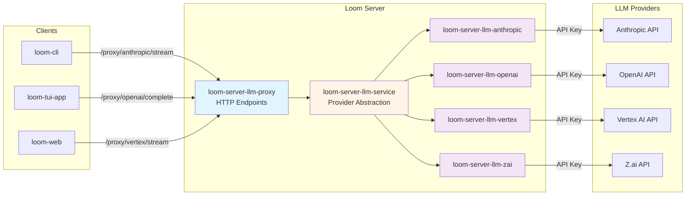

Loom uses a **server-side proxy architecture** for all LLM interactions. API keys are stored exclusively on the server, and clients communicate through HTTP proxy endpoints. This design provides enhanced security, centralized credential management, and unified observability.

## Architecture Diagram



## Key Properties

<CardGroup cols={2}>
  <Card title="Security" icon="lock">
    API keys never leave the server. No secrets in client binaries.
  </Card>
  <Card title="Centralized Credentials" icon="key">
    Single source of truth for API keys. Easy rotation and auditing.
  </Card>
  <Card title="Unified Observability" icon="chart-line">
    All LLM requests flow through proxy layer for logging and monitoring.
  </Card>
  <Card title="Multi-Provider Support" icon="plug">
    Server can host multiple providers simultaneously with separate credentials.
  </Card>
</CardGroup>

## Request Flow

### 1. Client Creates Provider-Specific Client

Clients use `ProxyLlmClient` from `loom-server-llm-proxy` crate:

```rust
use loom_server_llm_proxy::{ProxyLlmClient, LlmProvider};

// Convenience constructors for specific providers
let anthropic_client = ProxyLlmClient::anthropic("https://loom.example.com")?;
let openai_client = ProxyLlmClient::openai("https://loom.example.com")?;
let vertex_client = ProxyLlmClient::vertex("https://loom.example.com")?;
let zai_client = ProxyLlmClient::zai("https://loom.example.com")?;

// Or explicit provider selection
let client = ProxyLlmClient::new(
    "https://loom.example.com",
    LlmProvider::Anthropic
)?;
```

### 2. Client Sends Request to Provider-Specific Endpoint

The `ProxyLlmClient` implements the `LlmClient` trait and forwards requests to provider-specific endpoints:

<CodeGroup>
```rust Complete Request
let request = LlmRequest::new("claude-sonnet-4-20250514")
    .with_messages(messages)
    .with_tools(tools)
    .with_max_tokens(4096);

let response = anthropic_client.complete(request).await?;
// Sends POST to /proxy/anthropic/complete
```

```rust Streaming Request
let request = LlmRequest::new("gpt-4o")
    .with_messages(messages)
    .with_tools(tools);

let mut stream = openai_client.complete_streaming(request).await?;
// Sends POST to /proxy/openai/stream

while let Some(event) = stream.next().await {
    match event {
        LlmEvent::TextDelta { content } => print!("{}", content),
        LlmEvent::Completed(response) => break,
        LlmEvent::Error(err) => return Err(err.into()),
        _ => {}
    }
}
```
</CodeGroup>

### 3. Server Routes to Provider Client

The server's `LlmService` manages all provider clients and routes requests:

```rust
// Server startup (loom-server-llm-service)
let service = LlmService::from_env()?;
// Reads ANTHROPIC_API_KEY, OPENAI_API_KEY, VERTEX_API_KEY, ZAI_API_KEY

// Proxy endpoint handler (loom-server)
async fn handle_anthropic_stream(
    State(service): State<Arc<LlmService>>,
    Json(request): Json<LlmRequest>,
) -> Result<Sse<impl Stream<Item = Event>>, StatusCode> {
    let stream = service.complete_streaming_anthropic(request).await?;
    Ok(Sse::new(stream))
}
```

### 4. Provider Client Makes API Call

Provider-specific clients handle the actual API communication:

```rust
// loom-server-llm-anthropic
impl AnthropicClient {
    async fn complete_streaming(&self, request: LlmRequest) 
        -> Result<LlmStream, LlmError> 
    {
        let anthropic_request = convert_to_anthropic_format(request);
        
        let response = self.http_client
            .post(&self.config.base_url)
            .header("x-api-key", self.config.api_key.expose())
            .header("anthropic-version", "2023-06-01")
            .json(&anthropic_request)
            .send()
            .await?;
        
        let stream = parse_anthropic_sse_stream(response.bytes_stream());
        Ok(LlmStream::new(Box::pin(stream)))
    }
}
```

### 5. Response Streams Back Through Proxy

SSE events flow from provider → server → client:

```
Anthropic API → AnthropicClient → LlmService → Proxy Endpoint → ProxyLlmClient → CLI
```

## Proxy Endpoints

### Per-Provider Endpoints

Each provider has dedicated complete and stream endpoints:

<ParamField path="/proxy/anthropic/complete" type="POST">
  Non-streaming completion for Anthropic Claude
  
  **Request Body:** `LlmRequest` JSON  
  **Response:** `LlmResponse` JSON
</ParamField>

<ParamField path="/proxy/anthropic/stream" type="POST">
  SSE streaming completion for Anthropic Claude
  
  **Request Body:** `LlmRequest` JSON  
  **Response:** SSE stream of `LlmEvent` JSON
</ParamField>

<ParamField path="/proxy/openai/complete" type="POST">
  Non-streaming completion for OpenAI GPT
  
  **Request Body:** `LlmRequest` JSON  
  **Response:** `LlmResponse` JSON
</ParamField>

<ParamField path="/proxy/openai/stream" type="POST">
  SSE streaming completion for OpenAI GPT
  
  **Request Body:** `LlmRequest` JSON  
  **Response:** SSE stream of `LlmEvent` JSON
</ParamField>

<ParamField path="/proxy/vertex/complete" type="POST">
  Non-streaming completion for Google Vertex AI
  
  **Request Body:** `LlmRequest` JSON  
  **Response:** `LlmResponse` JSON
</ParamField>

<ParamField path="/proxy/vertex/stream" type="POST">
  SSE streaming completion for Google Vertex AI
  
  **Request Body:** `LlmRequest` JSON  
  **Response:** SSE stream of `LlmEvent` JSON
</ParamField>

<ParamField path="/proxy/zai/complete" type="POST">
  Non-streaming completion for Z.ai (智谱AI)
  
  **Request Body:** `LlmRequest` JSON  
  **Response:** `LlmResponse` JSON
</ParamField>

<ParamField path="/proxy/zai/stream" type="POST">
  SSE streaming completion for Z.ai
  
  **Request Body:** `LlmRequest` JSON  
  **Response:** SSE stream of `LlmEvent` JSON
</ParamField>

## Wire Format

### Request Format (All Providers)

```json
{
  "model": "claude-sonnet-4-20250514",
  "messages": [
    {
      "role": "user",
      "content": "Hello, world!"
    }
  ],
  "tools": [
    {
      "name": "read_file",
      "description": "Read a file from the filesystem",
      "input_schema": {
        "type": "object",
        "properties": {
          "path": { "type": "string" }
        },
        "required": ["path"]
      }
    }
  ],
  "max_tokens": 4096,
  "temperature": 0.7
}
```

### Complete Response Format

```json
{
  "message": {
    "role": "assistant",
    "content": "Hello! How can I help you today?"
  },
  "tool_calls": [],
  "usage": {
    "prompt_tokens": 15,
    "completion_tokens": 9,
    "total_tokens": 24
  },
  "finish_reason": "end_turn"
}
```

### Streaming Event Format

SSE stream with `LlmEvent` JSON payloads:

```
data: {"type":"text_delta","content":"Hello"}

data: {"type":"text_delta","content":"!"}

data: {"type":"completed","response":{"message":{...},"usage":{...}}}
```

<Info>
  The SSE format uses `\n\n` as the event delimiter. Each `data:` line contains a JSON-encoded `LlmEvent`.
</Info>

## LlmService Architecture

The `LlmService` crate (`loom-server-llm-service`) provides server-side provider abstraction:

### Configuration

```rust
pub struct LlmServiceConfig {
    pub anthropic_api_key: Option<SecretString>,
    pub openai_api_key: Option<SecretString>,
    pub vertex_api_key: Option<SecretString>,
    pub zai_api_key: Option<SecretString>,
}

impl LlmService {
    // Reads from environment variables
    pub fn from_env() -> Result<Self, LlmServiceError>;
}
```

### Provider Availability Checks

```rust
impl LlmService {
    pub fn has_anthropic(&self) -> bool;
    pub fn has_openai(&self) -> bool;
    pub fn has_vertex(&self) -> bool;
    pub fn has_zai(&self) -> bool;
}
```

### Provider-Specific Methods

```rust
impl LlmService {
    // Anthropic
    pub async fn complete_anthropic(
        &self,
        request: LlmRequest
    ) -> Result<LlmResponse, LlmError>;
    
    pub async fn complete_streaming_anthropic(
        &self,
        request: LlmRequest
    ) -> Result<LlmStream, LlmError>;
    
    // OpenAI
    pub async fn complete_openai(
        &self,
        request: LlmRequest
    ) -> Result<LlmResponse, LlmError>;
    
    pub async fn complete_streaming_openai(
        &self,
        request: LlmRequest
    ) -> Result<LlmStream, LlmError>;
    
    // Vertex AI
    pub async fn complete_vertex(
        &self,
        request: LlmRequest
    ) -> Result<LlmResponse, LlmError>;
    
    pub async fn complete_streaming_vertex(
        &self,
        request: LlmRequest
    ) -> Result<LlmStream, LlmError>;
    
    // Z.ai
    pub async fn complete_zai(
        &self,
        request: LlmRequest
    ) -> Result<LlmResponse, LlmError>;
    
    pub async fn complete_streaming_zai(
        &self,
        request: LlmRequest
    ) -> Result<LlmStream, LlmError>;
}
```

<Note>
  The server can have **all providers configured simultaneously**. Clients choose which provider to use by selecting the appropriate endpoint path.
</Note>

## Client Authentication

The proxy supports optional bearer token authentication:

```rust
let client = ProxyLlmClient::anthropic("https://loom.example.com")
    .with_auth_token(SecretString::new("user-token"));
```

The server validates tokens and enforces authorization policies based on user identity.

## Provider Implementations

### Anthropic Client (`loom-server-llm-anthropic`)

- **API:** `POST /v1/messages`
- **Headers:** `x-api-key`, `anthropic-version: 2023-06-01`
- **System messages:** Extracted to top-level `system` field
- **Tool results:** Sent as `tool_result` content blocks
- **Streaming:** SSE with `message_start` → `content_block_delta` → `message_stop`

### OpenAI Client (`loom-server-llm-openai`)

- **API:** `POST /chat/completions`
- **Headers:** `Authorization: Bearer {api_key}`
- **Tool choice:** Defaults to `"auto"` when tools provided
- **Streaming:** SSE with `data: [DONE]` marker

### Vertex AI Client (`loom-server-llm-vertex`)

- **API:** Google Cloud Vertex AI API
- **Auth:** Service account credentials
- **Models:** Gemini Pro, Gemini Flash, etc.

### Z.ai Client (`loom-server-llm-zai`)

- **API:** `POST /api/paas/v4/chat/completions` (OpenAI-compatible)
- **Headers:** `Authorization: Bearer {api_key}`
- **Models:** `glm-4.7`, `glm-4.6`, `glm-4.5`, `glm-4.5-flash`, etc.
- **Streaming:** SSE with `data: [DONE]` marker (OpenAI-compatible)

## Benefits

<CardGroup cols={2}>
  <Card title="Security" icon="shield-halved">
    - No API keys in client binaries or repositories
    - Centralized credential rotation
    - Audit logging at proxy layer
    - Token-based client authentication
  </Card>
  
  <Card title="Observability" icon="magnifying-glass-chart">
    - All LLM requests logged server-side
    - Unified metrics across providers
    - Cost tracking per user/organization
    - Performance monitoring
  </Card>
  
  <Card title="Flexibility" icon="wand-magic-sparkles">
    - Add providers without client updates
    - A/B test different models
    - Dynamic provider selection
    - Fallback to alternate providers
  </Card>
  
  <Card title="Cost Control" icon="coins">
    - Rate limiting per user/organization
    - Budget enforcement
    - Provider pooling (e.g., Claude subscription sharing)
    - Usage analytics
  </Card>
</CardGroup>

## Adding a New Provider

<Steps>
  <Step title="Create provider client crate">
    Create `loom-server-llm-{provider}` with `LlmClient` trait implementation.
  </Step>
  
  <Step title="Add to LlmService">
    Update `loom-server-llm-service` to include the new provider client.
  </Step>
  
  <Step title="Add proxy endpoints">
    Add `/proxy/{provider}/complete` and `/proxy/{provider}/stream` routes in `loom-server`.
  </Step>
  
  <Step title="Update ProxyLlmClient">
    Add convenience constructor in `loom-server-llm-proxy` (e.g., `ProxyLlmClient::new_provider()`).
  </Step>
</Steps>

<Warning>
  **No client-side changes required!** Once the server is updated, all clients automatically gain access to the new provider through the proxy.
</Warning>

## Related Documentation

<CardGroup cols={2}>
  <Card title="Architecture Overview" icon="sitemap" href="/architecture/overview">
    High-level system architecture
  </Card>
  <Card title="State Machine" icon="diagram-project" href="/architecture/state-machine">
    Agent state machine design
  </Card>
  <Card title="LLM Client Spec" icon="file-code" href="https://github.com/ghuntley/loom/blob/trunk/specs/llm-client.md">
    Detailed LLM client specification
  </Card>
  <Card title="Anthropic OAuth Pool" icon="file-code" href="https://github.com/ghuntley/loom/blob/trunk/specs/anthropic-oauth-pool.md">
    Claude subscription pooling
  </Card>
</CardGroup>
