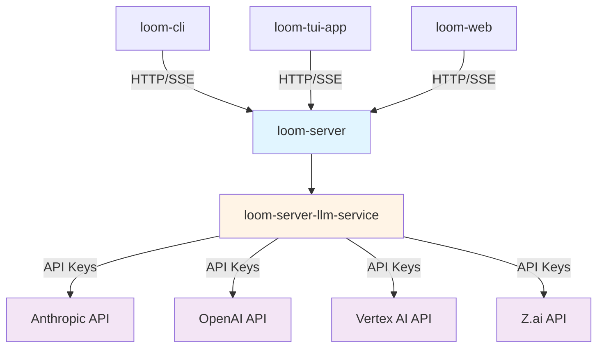

Loom is an AI-powered coding agent built in Rust as a Cargo workspace with 80+ specialized crates. The system follows a server-side proxy architecture where API keys are stored server-side, and clients communicate through HTTP endpoints.

## Design Principles

Loom's architecture is built on three core principles:

<CardGroup cols={3}>
  <Card title="Modularity" icon="cubes">
    Clean separation between core abstractions, LLM providers, and tools
  </Card>
  <Card title="Extensibility" icon="puzzle-piece">
    Easy addition of new LLM providers and tools via trait implementations
  </Card>
  <Card title="Reliability" icon="shield-check">
    Robust error handling with retry mechanisms and structured logging
  </Card>
</CardGroup>

## High-Level Architecture



## Workspace Structure

Loom is organized as a Cargo workspace with 80+ crates under `crates/`. The workspace follows a layered architecture:

### Layer Organization

<AccordionGroup>
  <Accordion title="Common Layer (loom-common-*)">
    Foundation crates providing shared functionality:
    - `loom-common-core` - Core abstractions (`LlmClient`, `Agent`, state machine)
    - `loom-common-http` - HTTP client with retry logic and User-Agent
    - `loom-common-config` - Configuration management
    - `loom-common-secret` - Secret handling with `Secret<T>` wrapper
    - `loom-common-thread` - Conversation persistence and sync
    - `loom-common-webhook` - Webhook handling
    - `loom-common-i18n` - Internationalization (17 locales)
    - `loom-common-spool` - Version control integration
    - `loom-common-version` - Version management
  </Accordion>

  <Accordion title="Server Layer (loom-server-*)">
    Server-side components:
    - `loom-server` - Main HTTP API server
    - `loom-server-api` - API route handlers
    - `loom-server-db` - Database access layer
    - `loom-server-llm-service` - LLM provider abstraction
    - `loom-server-llm-proxy` - LLM proxy endpoints
    - `loom-server-llm-anthropic` - Anthropic Claude client
    - `loom-server-llm-openai` - OpenAI GPT client
    - `loom-server-llm-vertex` - Google Vertex AI client
    - `loom-server-llm-zai` - Z.ai client
    - `loom-server-auth*` - Authentication providers (OAuth, magic links, OIDC)
    - `loom-server-k8s` - Kubernetes integration
    - `loom-server-weaver` - Remote execution pods
    - `loom-server-scm` - Git hosting
    - `loom-server-analytics` - PostHog-style analytics
    - And many more specialized services...
  </Accordion>

  <Accordion title="CLI Layer (loom-cli-*)">
    Command-line interface crates:
    - `loom-cli` - Main CLI binary
    - `loom-cli-config` - CLI configuration
    - `loom-cli-credentials` - Credential management
    - `loom-cli-tools` - Agent tool implementations
    - `loom-cli-git` - Git operations
    - `loom-cli-auto-commit` - Auto-commit after tool execution
    - `loom-cli-acp` - Agent Client Protocol
    - `loom-cli-spool` - Spool (jj-based VCS) integration
  </Accordion>

  <Accordion title="Observability Suite">
    Integrated observability platform:
    - `loom-analytics-core` - Analytics core types
    - `loom-analytics` - Analytics client
    - `loom-crash-core` - Crash reporting types
    - `loom-crash` - Crash reporter
    - `loom-crash-symbolicate` - Source map symbolication
    - `loom-crons-core` - Cron monitoring types
    - `loom-crons` - Cron monitoring client
    - `loom-sessions-core` - Session analytics types
    - `loom-flags-core` - Feature flags core
    - `loom-flags` - Feature flags client
  </Accordion>

  <Accordion title="TUI Layer (loom-tui-*)">
    Terminal UI components (Ratatui 0.30):
    - `loom-tui-app` - Main TUI application
    - `loom-tui-core` - Core TUI abstractions
    - `loom-tui-component` - Component system
    - `loom-tui-theme` - Theming support
    - `loom-tui-widget-*` - Reusable widgets (message list, input box, markdown, etc.)
    - `loom-tui-storybook` - Visual snapshot testing
  </Accordion>

  <Accordion title="Weaver (Remote Execution)">
    Kubernetes-based remote execution:
    - `loom-weaver-secrets` - SPIFFE-style identity and secrets
    - `loom-weaver-audit-sidecar` - eBPF syscall auditing
    - `loom-weaver-wgtunnel` - WireGuard tunnel client
    - `loom-weaver-ebpf` - eBPF programs
    - `loom-wgtunnel-*` - WireGuard tunnel with DERP relay
  </Accordion>
</AccordionGroup>

## Key Components

### Core Agent

The agent state machine manages conversation flow and tool orchestration. See [Agent State Machine](/architecture/state-machine) for details.

- Event-driven architecture
- Explicit state transitions
- Built-in retry mechanisms
- Clean separation of I/O from state logic

### LLM Proxy

Server-side proxy architecture keeps API keys secure. See [LLM Proxy Architecture](/architecture/llm-proxy) for details.

<Note>
  **API keys never leave the server.** Clients communicate through proxy endpoints using provider-specific paths like `/proxy/anthropic/stream`.
</Note>

### Tool System

Extensible tool registry for agent capabilities:

- `Tool` trait for implementation
- JSON Schema-based input validation
- Async execution
- Progress reporting

### Thread System

Conversation persistence with FTS5 search:

- SQLite-based storage
- Full-text search across all messages
- Git metadata tracking
- Sync across devices

## Dependency Flow

```
loom-common-core (bottom layer)
    ↑
loom-common-http (utility layer)
    ↑
loom-server-llm-* (provider layer, server-only)
    ↑
loom-server-llm-service (server-side provider abstraction)
    ↑
loom-server (HTTP server with proxy endpoints)
    ↑
loom-server-llm-proxy (client-side LlmClient via HTTP)
    ↑
loom-cli-tools (tool layer, depends only on loom-common-core)
    ↑
loom-cli (top layer, orchestrates everything)
```

<Warning>
  **Key constraint:** Crates at lower layers never depend on higher layers. This ensures:
  - Core types are reusable across all providers
  - Provider implementations are isolated to server-side
  - Clients interact only through the proxy abstraction
</Warning>

## Build System

### Nix + cargo2nix (Preferred)

Loom uses cargo2nix for reproducible builds with per-crate caching:

```bash
# Build CLI
nix build .#loom-cli-c2n

# Build server
nix build .#loom-server-c2n

# Build any crate
nix build .#loom-common-http-c2n

# Update Cargo.nix after modifying dependencies
cargo2nix-update
```

### Cargo (Development)

For quick iteration during development:

```bash
# Build everything
cargo build --workspace

# Run tests
cargo test --workspace

# Lint
cargo clippy --workspace -- -D warnings

# Format
cargo fmt --all
```

## Deployment

Deployments happen automatically via `git push` to the `trunk` branch:

1. NixOS server checks for new commits every 10 seconds
2. Automatic rebuild when changes detected
3. Service restart with new binary
4. Health checks verify deployment

```bash
# Deploy
git push origin trunk

# Check deployment status
sudo systemctl status nixos-auto-update.service

# View logs
sudo journalctl -u nixos-auto-update.service -f
```

## Next Steps

<CardGroup cols={2}>
  <Card title="LLM Proxy" icon="server" href="/architecture/llm-proxy">
    Learn about the server-side LLM proxy architecture
  </Card>
  <Card title="State Machine" icon="diagram-project" href="/architecture/state-machine">
    Understand the agent state machine design
  </Card>
  <Card title="Workspace Structure" icon="folder-tree" href="/architecture/workspace-structure">
    Explore the complete crate organization
  </Card>
  <Card title="Specifications" icon="file-lines" href="https://github.com/ghuntley/loom/tree/trunk/specs">
    Read detailed specs for all features
  </Card>
</CardGroup>
