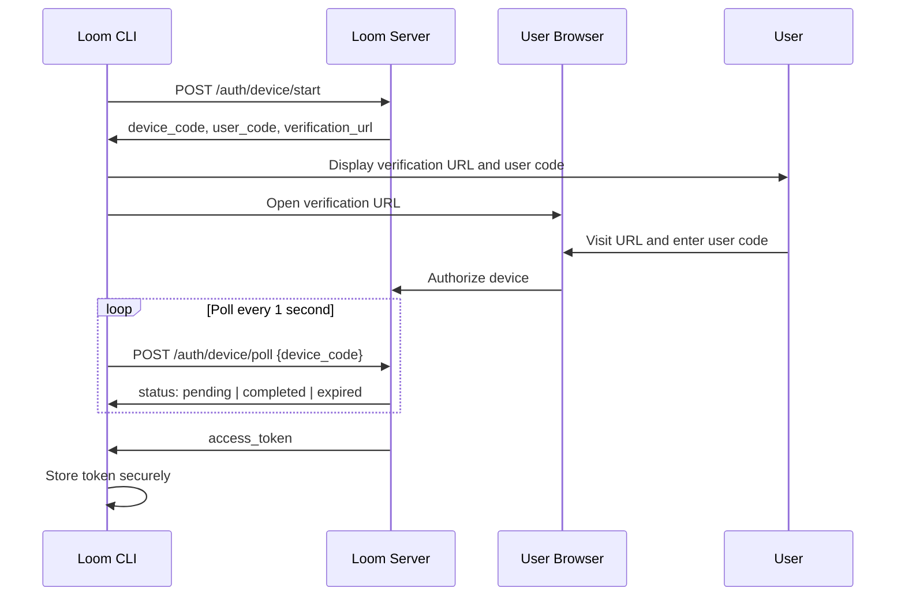
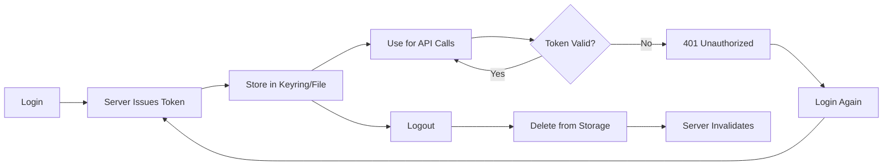

## Overview

Loom CLI uses OAuth2 device code flow for secure, user-friendly authentication. This method is ideal for command-line tools as it doesn't require embedding client secrets or handling browser redirects.

## Authentication Flow

### Device Code Flow



## Commands

### login

Authenticate with Loom services.

```bash
loom --server-url <URL> login
```

<ParamField path="--server-url" type="string" required>
  Loom server URL to authenticate against
  
  Example: `https://loom.ghuntley.com`
</ParamField>

**Example:**

```bash
loom --server-url https://loom.ghuntley.com login
```

**Output:**
```
Please visit: https://loom.ghuntley.com/auth/device
And enter code: ABCD-1234

Waiting for authorization........
Successfully logged in to https://loom.ghuntley.com
```

**Process:**

1. CLI initiates device code flow with server
2. Server generates:
   - `device_code`: Secret code for polling (not shown to user)
   - `user_code`: Short code for user to enter (e.g., "ABCD-1234")
   - `verification_url`: URL where user authorizes
   - `expires_in`: Timeout in seconds (typically 300-600)
3. CLI displays verification URL and user code
4. CLI attempts to open URL in default browser
5. CLI polls server every 1 second until:
   - User completes authorization → receives access token
   - Flow expires → returns error
   - User cancels with Ctrl+C → aborts
6. Access token is stored securely

### logout

Log out and clear credentials.

```bash
loom --server-url <URL> logout
```

<ParamField path="--server-url" type="string" required>
  Loom server URL to log out from
</ParamField>

**Example:**

```bash
loom --server-url https://loom.ghuntley.com logout
```

**Output:**
```
Logged out from https://loom.ghuntley.com
```

**Process:**

1. CLI loads stored token for the server URL
2. Calls `POST /auth/logout` with token to invalidate server-side
3. Deletes token from local credential store
4. Token can no longer be used for API calls

## Credential Storage

### Storage Strategy

Loom uses a **keyring-first, file-fallback** strategy:

1. **Primary: System Keyring**
   - macOS: Keychain
   - Windows: Credential Manager  
   - Linux: Secret Service (libsecret, gnome-keyring, KWallet)
   
2. **Fallback: Encrypted File**
   - Location: `~/.config/loom/credentials.json`
   - Used when keyring is unavailable
   - Permissions: `0600` (owner read/write only)

### Credential Format

Credentials are stored per-server using a sanitized server key:

```rust
// Server URL: https://loom.ghuntley.com
// Sanitized key: https___loom_ghuntley_com
```

Sanitization replaces all non-alphanumeric characters with underscores to ensure valid keyring/filename.

### Security Features

1. **Keyring Integration**: Leverages OS-level secure storage
2. **File Permissions**: Restrictive permissions on fallback file
3. **Token Redaction**: Tokens are never logged or displayed
4. **Server Isolation**: Each server's credentials are stored separately

### Multiple Servers

You can authenticate with multiple Loom servers:

```bash
# Production server
loom --server-url https://loom.ghuntley.com login

# Staging server
loom --server-url https://staging.loom.ghuntley.com login

# Local development
loom --server-url http://localhost:8080 login
```

Each server's credentials are stored independently.

## Token Management

### Token Lifecycle



### Token Expiration

Loom access tokens may expire after a period (configured server-side). When a token expires:

1. API calls return `401 Unauthorized`
2. CLI displays authentication error
3. Run `loom login` again to obtain a new token

**Example:**
```bash
loom --server-url https://loom.ghuntley.com list

Error: failed to list threads: 401 Unauthorized

# Solution: Re-authenticate
loom --server-url https://loom.ghuntley.com login
```

### Token Inspection

Tokens are opaque strings and should not be inspected or manipulated manually.

<Warning>
  Never share your access token. It grants full access to your account.
</Warning>

## Error Handling

### Common Errors

**Browser Failed to Open:**
```
Failed to open browser. Please visit the URL manually.
Please visit: https://loom.ghuntley.com/auth/device
```

Solution: Copy and paste the URL into your browser manually.

**Device Code Expired:**
```
Device code expired. Please try again.
```

Solution: Run `loom login` again. Complete authorization faster (typically 5-10 minute window).

**Network Error:**
```
failed to start device auth: connection refused
```

Solutions:
- Verify server URL is correct
- Check network connectivity
- Ensure server is running

**User Cancelled:**
```
Login cancelled by user
```

Occurs when pressing Ctrl+C during device code flow. Safe to ignore.

### Troubleshooting Authentication

**Check Server Connectivity:**
```bash
curl https://loom.ghuntley.com/health
```

**Verify Credentials File:**
```bash
ls -la ~/.config/loom/credentials.json
# Should be: -rw------- (permissions 600)
```

**Check Keyring Status (Linux):**
```bash
# Ensure secret service is running
systemctl --user status gnome-keyring

# Or for KDE
systemctl --user status kwallet
```

**Delete and Re-authenticate:**
```bash
# Remove stored credentials
rm ~/.config/loom/credentials.json

# Or logout first
loom --server-url https://loom.ghuntley.com logout

# Then login again
loom --server-url https://loom.ghuntley.com login
```

## Advanced Usage

### Environment Variable

Set default server URL:

```bash
export LOOM_SERVER_URL=https://loom.ghuntley.com
loom login  # Uses LOOM_SERVER_URL
loom list   # Uses LOOM_SERVER_URL
```

### Programmatic Access

The `loom-cli-credentials` crate can be used in other Rust programs:

```rust
use loom_cli_credentials::{CredentialStore, CredentialValue, KeyringThenFileStore};
use loom_common_secret::SecretString;

#[tokio::main]
async fn main() -> Result<(), Box<dyn std::error::Error>> {
    let store = KeyringThenFileStore::new(
        "loom",
        PathBuf::from("/home/user/.config/loom/credentials.json")
    );
    
    // Load credentials
    if let Some(CredentialValue::ApiKey { key }) = store.load("server_key").await? {
        println!("Found token");
    }
    
    // Save credentials  
    let token = SecretString::new("new_token".to_string());
    let creds = CredentialValue::ApiKey { key: token };
    store.save("server_key", &creds).await?;
    
    Ok(())
}
```

### Git Credential Helper

Loom can act as a git credential helper for authenticated git operations:

```bash
# Configure git to use Loom for specific domain
git config --global credential.https://loom.ghuntley.com.helper 'loom credential-helper'

# Now git operations automatically use Loom authentication
git clone https://loom.ghuntley.com/scm/myorg/myrepo.git
```

See `loom credential-helper --help` for details.

## Security Best Practices

### Do's

1. ✅ Use strong, unique passwords for your Loom account
2. ✅ Log out from shared/public computers
3. ✅ Keep your system's keyring/credential manager secure
4. ✅ Regularly update Loom CLI to latest version
5. ✅ Use different accounts for different environments (prod/staging)

### Don'ts

1. ❌ Never share your access token
2. ❌ Never commit credentials.json to version control
3. ❌ Never use same token on multiple machines (login separately)
4. ❌ Never set overly permissive file permissions on credentials.json
5. ❌ Never disable certificate validation in production

## Internationalization

Authentication messages are localized based on system locale:

**English (en):**
```
Please visit: https://loom.ghuntley.com/auth/device
And enter code: ABCD-1234
Successfully logged in to https://loom.ghuntley.com
```

**Spanish (es):**
```
Por favor visite: https://loom.ghuntley.com/auth/device
E ingrese el código: ABCD-1234
Inició sesión exitosamente en https://loom.ghuntley.com
```

**Supported Languages:**
- English (en)
- Spanish (es)
- Arabic (ar)

## Related Pages

<CardGroup cols={2}>
  <Card title="CLI Overview" icon="terminal" href="/cli/overview">
    Main CLI commands and setup
  </Card>
  <Card title="REPL Commands" icon="message" href="/cli/repl">
    Interactive session after authentication
  </Card>
</CardGroup>