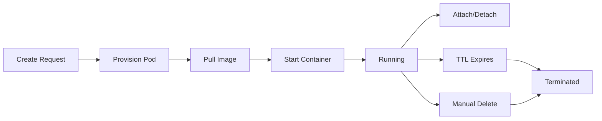

## Overview

Weavers are ephemeral Kubernetes pods that provide isolated, remote development environments for running Loom REPL sessions. Each weaver runs a container with a full development environment and can optionally clone a git repository.

## Quick Start

```bash
# Create and attach to a new weaver
loom new

# Create with specific image
loom new --image ghcr.io/ghuntley/loom/weaver:latest

# Create with git repository
loom new --repo https://github.com/user/repo --branch main

# List running weavers
loom weaver ps

# Attach to existing weaver
loom attach <weaver-id>

# Delete weaver
loom weaver delete <weaver-id>
```

## Commands

### new

Create a new remote weaver session.

```bash
loom new [OPTIONS]
loom weaver new [OPTIONS]
```

<ParamField path="--image, -i" type="string" default="ghcr.io/ghuntley/loom/weaver:latest">
  Container image to use for the weaver
</ParamField>

<ParamField path="--org, -o" type="string">
  Organization ID, slug, or name. Defaults to your personal organization if not specified.
</ParamField>

<ParamField path="--repo" type="string">
  Git repository to clone (public HTTPS URL)
  
  Example: `https://github.com/user/repo`
</ParamField>

<ParamField path="--branch" type="string">
  Git branch to checkout (requires `--repo`)
  
  Example: `main`, `develop`, `feature/new-api`
</ParamField>

<ParamField path="--env, -e" type="string" repeatable>
  Environment variables (repeatable)
  
  Format: `KEY=VALUE`
  
  Example: `-e NODE_ENV=production -e DEBUG=true`
</ParamField>

<ParamField path="--ttl" type="integer" default={4}>
  Lifetime in hours (max: 48)
  
  Weaver will automatically terminate after this duration.
</ParamField>

**Example:**

```bash
# Create weaver with custom image and repository
loom new \
  --image ghcr.io/myorg/dev-env:latest \
  --repo https://github.com/myorg/myproject \
  --branch develop \
  --env NODE_ENV=development \
  --env API_KEY=test123 \
  --ttl 8
```

**Output:**
```
Creating weaver...
Weaver created: weaver-a1b2c3d4
Image: ghcr.io/myorg/dev-env:latest
Lifetime: 8 hours

Attaching to weaver...
[Connected to remote terminal]
```

### attach

Attach to a running weaver's terminal.

```bash
loom attach <weaver-id>
loom weaver attach <weaver-id>
```

<ParamField path="weaver-id" type="string" required>
  Weaver ID to attach to
</ParamField>

**Example:**

```bash
loom attach weaver-a1b2c3d4
```

**Output:**
```
Attaching to weaver weaver-a1b2c3d4...
[Connected to remote terminal]

# You're now in the weaver's shell
root@weaver-a1b2c3d4:/workspace# 
```

**Detaching:**
- The connection uses WebSocket for bidirectional terminal I/O
- Press `Ctrl+C` or close terminal to detach
- The weaver continues running after detach
- Reattach later with `loom attach <weaver-id>`

### ps

List all running weavers.

```bash
loom weaver ps [OPTIONS]
```

<ParamField path="--json" type="boolean" default={false}>
  Output as JSON
</ParamField>

**Example:**

```bash
loom weaver ps
```

**Output:**
```
ID                                       IMAGE                              STATUS     AGE     TTL
----------------------------------------------------------------------------------------------------
weaver-a1b2c3d4e5f6g7h8i9j0k1l2m3n4o5p6  ghcr.io/ghuntley/loom/weaver:l...  Running    2.3h    4h
weaver-b2c3d4e5f6g7h8i9j0k1l2m3n4o5p6q7  ghcr.io/myorg/dev-env:latest       Running    0.5h    8h
```

**JSON Output:**

```bash
loom weaver ps --json
```

```json
{
  "weavers": [
    {
      "id": "weaver-a1b2c3d4e5f6g7h8i9j0k1l2m3n4o5p6",
      "pod_name": "weaver-a1b2c3d4e5f6g7h8i9j0k1l2m3n4o5p6",
      "status": "Running",
      "created_at": "2024-03-15T10:30:00Z",
      "image": "ghcr.io/ghuntley/loom/weaver:latest",
      "lifetime_hours": 4,
      "age_hours": 2.3
    }
  ],
  "count": 1
}
```

### delete

Delete a weaver (terminates the pod).

```bash
loom weaver delete <weaver-id>
```

<ParamField path="weaver-id" type="string" required>
  Weaver ID to delete
</ParamField>

**Example:**

```bash
loom weaver delete weaver-a1b2c3d4
```

**Output:**
```
Deleting weaver weaver-a1b2c3d4...
Weaver deleted.
```

<Warning>
  Deletion is immediate and irreversible. Any unsaved work in the weaver will be lost.
</Warning>

## Architecture

### Kubernetes Backend

Weavers run as Kubernetes pods in the `loom-weavers` namespace:

- **Orchestration**: Managed by `loom-server-weaver` provisioner
- **Networking**: Each pod gets a cluster IP for WebSocket connections
- **Storage**: Ephemeral storage (data is lost when pod terminates)
- **Resources**: Configurable CPU/memory limits via server config

### WebSocket Protocol

Attachment uses WebSocket for bidirectional terminal I/O:

1. **Connection**: CLI connects to `wss://server/api/weaver/<id>/attach`
2. **Authentication**: Bearer token in `Authorization` header
3. **Stdin**: Binary messages sent to pod's stdin
4. **Stdout/Stderr**: Binary messages received from pod
5. **Ping/Pong**: Automatic keepalive
6. **Close**: Graceful disconnection on Ctrl+C or EOF

### Lifecycle



**States:**
- **Pending**: Pod is being scheduled/started
- **Running**: Container is running and ready
- **Succeeded**: Container exited with code 0
- **Failed**: Container crashed or failed to start
- **Unknown**: Status cannot be determined

## Organization Management

### Personal Organization

Every user has a personal organization for individual weavers:

```bash
# Uses your personal org by default
loom new
```

### Team Organizations

Create weavers in shared team organizations:

```bash
# By organization ID
loom new --org 01HX2K3M4N5P6Q7R8S9T0V1W2X3Y4Z5A

# By organization slug
loom new --org my-team

# By organization name
loom new --org "Engineering Team"
```

The CLI resolves organization references automatically:
1. If it looks like a UUID → use as organization ID
2. Otherwise → lookup by slug or name via API

## Environment Variables

Pass environment variables to weavers:

```bash
loom new \
  -e DATABASE_URL=postgresql://localhost/dev \
  -e API_KEY=secret123 \
  -e DEBUG=true
```

Variables are set in the container environment and available to all processes.

## Git Integration

### Clone Repository

Weavers can automatically clone a git repository on startup:

```bash
loom new \
  --repo https://github.com/user/repo \
  --branch feature/new-api
```

**Requirements:**
- Repository must be public (HTTPS URL)
- Branch is optional (defaults to repository's default branch)
- Clone happens during container initialization

### Working Directory

When a repository is cloned:
- Working directory: `/workspace/<repo-name>`
- Git repository is ready to use
- All tools operate within this workspace

## Troubleshooting

### Weaver Creation Fails

**Image Pull Error:**
```
Failed to create weaver: ImagePullBackOff
```

Solutions:
- Verify the image exists and is accessible
- Check image registry credentials are configured on server
- Use a public image for testing

**Authentication Error:**
```
Failed to create weaver: 401 Unauthorized
```

Solution:
```bash
loom --server-url https://loom.ghuntley.com login
```

### Weaver Exits Immediately

**Container has no long-running process:**
```bash
loom weaver ps
# Status: Succeeded
```

Solution:
- Weaver images must run a persistent process (e.g., `tail -f /dev/null`, shell, or REPL)
- Check container's CMD/ENTRYPOINT is not a one-shot command

### Connection Issues

**WebSocket Connection Failed:**
```
Failed to connect to weaver: WebSocket error
```

Solutions:
- Check network connectivity to server
- Verify server allows WebSocket connections
- Check firewall allows WSS traffic

**Timeout During Attach:**
- Weaver may be starting up (wait for Running status)
- Check weaver status: `loom weaver ps`

### Debug with kubectl

Server operators can debug weavers directly:

```bash
# List all weaver pods
sudo kubectl get pods -n loom-weavers

# Describe pod
sudo kubectl describe pod <pod-name> -n loom-weavers

# View logs
sudo kubectl logs <pod-name> -n loom-weavers

# Delete stuck pod
sudo kubectl delete pod <pod-name> -n loom-weavers --force
```

## Server Configuration

Weaver behavior is configured server-side in `loom-server` config:

```toml
[weaver]
enabled = true
namespace = "loom-weavers"
default_image = "ghcr.io/ghuntley/loom/weaver:latest"
default_lifetime_hours = 4
max_lifetime_hours = 48

[weaver.resources]
limits_cpu = "2"
limits_memory = "4Gi"
requests_cpu = "500m"
requests_memory = "1Gi"
```

See server configuration documentation for full details.

## Security Considerations

### Isolation

- Each weaver runs in an isolated Kubernetes pod
- Network policies can restrict pod-to-pod communication
- Resource limits prevent resource exhaustion

### Authentication

- All weaver API calls require valid authentication token
- WebSocket connections verify token before allowing attachment
- Users can only access weavers in their authorized organizations

### Secrets

<Warning>
  Do not pass secrets via `--env` flags. They will be visible in command history and potentially logs.
</Warning>

Better approaches:
- Use Kubernetes secrets (requires server-side configuration)
- Mount secrets as files in container
- Fetch secrets from secret manager at runtime

## Best Practices

### Resource Management

1. **Set appropriate TTL**: Don't waste resources on idle weavers
2. **Delete when done**: Manually delete weavers you're finished with
3. **Monitor usage**: Use `loom weaver ps` to track active weavers

### Container Images

1. **Use specific tags**: Avoid `latest` for reproducibility
2. **Keep images small**: Faster startup times
3. **Include necessary tools**: Git, text editors, language runtimes
4. **Set working directory**: Use `WORKDIR /workspace` in Dockerfile

### Git Workflows

1. **Clone vs Manual**: Use `--repo` for quick setup, manual clone for flexibility
2. **Branch naming**: Use descriptive branch names for easy identification
3. **Commit often**: Weaver storage is ephemeral

## Related Pages

<CardGroup cols={2}>
  <Card title="CLI Overview" icon="terminal" href="/cli/overview">
    Main CLI commands and setup
  </Card>
  <Card title="REPL Commands" icon="message" href="/cli/repl">
    Interactive session tools and usage
  </Card>
</CardGroup>