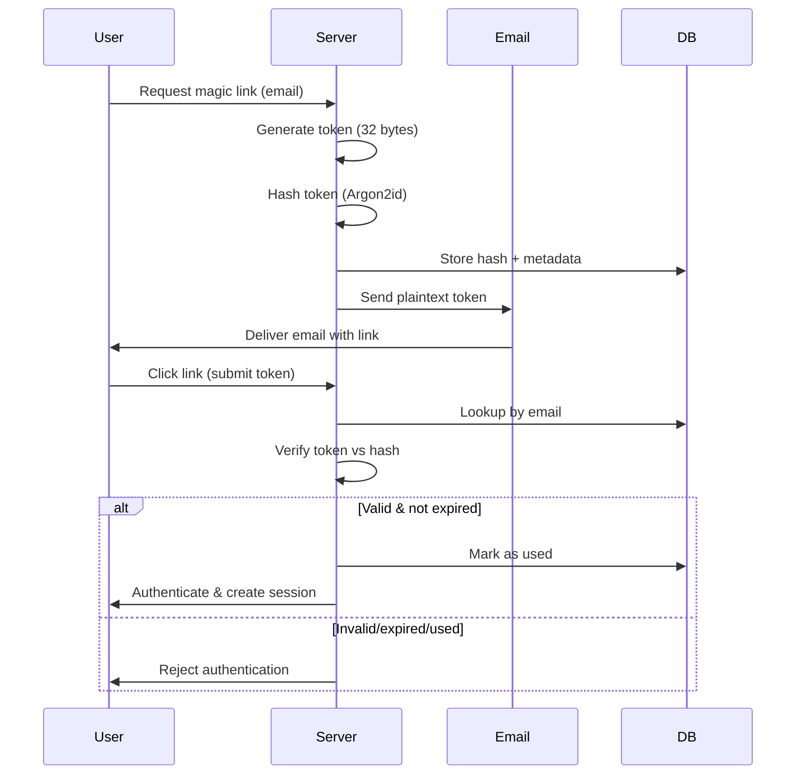

Loom supports multiple authentication methods to provide secure, flexible access across different use cases: web-based OAuth flows, passwordless magic links, and device code flow for CLI and headless environments.

## Authentication Methods

<CardGroup cols={2}>
  <Card title="OAuth 2.0" icon="google">
    Industry-standard OAuth flows for Google and GitHub
  </Card>
  <Card title="Magic Links" icon="envelope">
    Passwordless email-based authentication
  </Card>
  <Card title="Device Code Flow" icon="terminal">
    CLI and VS Code authentication via browser
  </Card>
  <Card title="Okta SSO" icon="shield-halved">
    Enterprise SAML/OIDC authentication
  </Card>
</CardGroup>

## OAuth 2.0 Providers

Loom implements OAuth 2.0 / OpenID Connect flows for third-party authentication providers.

### Google OAuth

<Steps>
  <Step title="Configure OAuth App">
    Set up a Google OAuth 2.0 application in the [Google Cloud Console](https://console.cloud.google.com/):
    
    ```bash
    LOOM_SERVER_GOOGLE_CLIENT_ID=your-client-id.apps.googleusercontent.com
    LOOM_SERVER_GOOGLE_CLIENT_SECRET=GOCSPX-...
    LOOM_SERVER_GOOGLE_REDIRECT_URI=https://your-domain.com/auth/google/callback
    ```
  </Step>
  
  <Step title="OAuth Flow">
    The Google OAuth flow uses OpenID Connect with the following scopes:
    - `openid` - Required for OIDC
    - `email` - Access to user's email address
    - `profile` - Access to user's display name and avatar
    
    **Security features:**
    - **State parameter** for CSRF protection (random, unguessable)
    - **Nonce parameter** for replay protection (validated in ID token)
    - **ID token signature verification** using Google's public keys
  </Step>
  
  <Step title="User Claims">
    After successful authentication, Loom extracts user identity from the ID token:
    
    ```rust
    // loom-server-auth-google/src/lib.rs:607
    pub fn decode_id_token(&self, id_token: &str) -> Result<GoogleIdTokenClaims, OAuthError> {
        let parts: Vec<&str> = id_token.split('.').collect();
        if parts.len() != 3 {
            return Err(OAuthError::InvalidIdToken("ID token must have 3 parts".to_string()));
        }
        
        let payload = parts[1];
        let decoded = URL_SAFE_NO_PAD.decode(payload)
            .map_err(|e| OAuthError::InvalidIdToken(format!("failed to decode payload: {e}")))?
        
        let claims: GoogleIdTokenClaims = serde_json::from_slice(&decoded)
            .map_err(|e| OAuthError::InvalidIdToken(format!("failed to parse claims: {e}")))?
        
        Ok(claims)
    }
    ```
    
    **Available claims:**
    - `sub` - Google's unique user ID (stable identifier)
    - `email` - User's email address
    - `email_verified` - Whether email is verified by Google
    - `name` - User's display name
    - `picture` - Avatar image URL
  </Step>
</Steps>

<Note>
  The ID token approach is preferred over the `/userinfo` endpoint because it avoids an extra API call and provides cryptographically verifiable claims.
</Note>

### GitHub OAuth

GitHub OAuth provides seamless authentication for developers already using GitHub.

```bash
# Configuration
LOOM_SERVER_GITHUB_CLIENT_ID=Iv1.abc123def456
LOOM_SERVER_GITHUB_CLIENT_SECRET=abc123...
LOOM_SERVER_GITHUB_REDIRECT_URI=https://your-domain.com/auth/github/callback
```

**Requested scopes:**
- `user:email` - Read user's email addresses (including private)
- `read:user` - Read user profile information

**Authentication flow:**

<Steps>
  <Step title="Authorization URL Generation">
    ```rust
    // loom-server-auth-github/src/lib.rs:355
    pub fn authorization_url(&self, state: &str) -> String {
        let mut url = Url::parse(GITHUB_AUTHORIZE_URL).expect("invalid authorize URL");
        
        url.query_pairs_mut()
            .append_pair("client_id", &self.config.client_id)
            .append_pair("redirect_uri", &self.config.redirect_uri)
            .append_pair("scope", &self.config.scopes_string())
            .append_pair("state", state);
        
        url.to_string()
    }
    ```
  </Step>
  
  <Step title="Code Exchange">
    Exchange the authorization code for an access token:
    
    ```rust
    // loom-server-auth-github/src/lib.rs:388
    pub async fn exchange_code(&self, code: &str) -> Result<GitHubTokenResponse, OAuthError> {
        let response = self.http_client
            .post(GITHUB_TOKEN_URL)
            .header("Accept", "application/json")
            .form(&[
                ("client_id", self.config.client_id.as_str()),
                ("client_secret", self.config.client_secret.expose().as_str()),
                ("code", code),
                ("redirect_uri", self.config.redirect_uri.as_str()),
            ])
            .send()
            .await?
        
        // Parse token response...
    }
    ```
  </Step>
  
  <Step title="Fetch User Data">
    Retrieve user profile and verified emails:
    
    ```rust
    // Get user profile
    let user = client.get_user(token.access_token.expose()).await?;
    
    // Get all email addresses (including private)
    let emails = client.get_emails(token.access_token.expose()).await?;
    
    // Find primary verified email
    let primary_email = emails.iter()
        .find(|e| e.primary && e.verified)
        .map(|e| e.email.clone());
    ```
  </Step>
</Steps>

<Warning>
  Always use verified emails (`email_verified: true` for GitHub emails) for security. Unverified emails can be set by anyone and should not be trusted for authentication.
</Warning>

## Magic Links

Magic links provide passwordless authentication via email. Users receive a unique, time-limited link that logs them in when clicked.

### Security Properties

<CardGroup cols={2}>
  <Card title="Single-Use" icon="1">
    Each link can only be used once. After verification, the link is marked as used and cannot be reused.
  </Card>
  <Card title="Short-Lived" icon="clock">
    Links expire after 10 minutes to minimize the window for token interception.
  </Card>
  <Card title="Cryptographically Secure" icon="key">
    Tokens are generated using 32 bytes of cryptographically secure random data (256 bits of entropy).
  </Card>
  <Card title="Argon2id Hashing" icon="lock">
    Tokens are hashed with Argon2id before storage, protecting against database leaks.
  </Card>
</CardGroup>

### Flow Overview



### Implementation Details

```rust
// loom-server-auth-magiclink/src/lib.rs:156
pub fn new(email: impl AsRef<str> + Into<String>) -> (Self, String) {
    let (token, hash) = generate_magic_link_token();
    let now = Utc::now();
    let id = Uuid::new_v4();
    
    let link = Self {
        id,
        email: email.into(),
        token_hash: hash,  // Argon2id hash, safe to store
        created_at: now,
        expires_at: now + Duration::minutes(MAGIC_LINK_EXPIRY_MINUTES),  // 10 minutes
        used_at: None,
    };
    
    (link, token)  // Return hash for storage, token for email
}
```

**Token generation:**
```rust
// loom-server-auth-magiclink/src/lib.rs:241
pub fn generate_magic_link_token() -> (String, String) {
    use rand::Rng;
    
    let mut rng = rand::thread_rng();
    let bytes: [u8; MAGIC_LINK_TOKEN_BYTES] = rng.gen();  // 32 bytes = 256 bits
    let token = hex::encode(bytes);  // 64 hex characters
    let hash = hash_magic_link_token(&token);  // Argon2id hash
    (token, hash)
}
```

**Why Argon2id over SHA-256?**

<Accordion title="Argon2id provides stronger protection">
  While 32-byte tokens have 256 bits of entropy (making brute-force infeasible), Argon2id provides defense-in-depth:
  
  1. **Brute-force resistance** - Memory-hard design makes GPU/ASIC attacks significantly more expensive
  2. **Future-proof** - Additional protection if token generation is ever weakened
  3. **Industry best practice** - OWASP recommends Argon2id for password and token hashing
  4. **Salt included** - Each hash includes a unique salt, preventing rainbow table attacks
  
  The trade-off is slightly higher CPU cost per verification (~50-100ms), which is acceptable for the low-frequency magic link flow.
</Accordion>

**Token verification:**
```rust
// loom-server-auth-magiclink/src/lib.rs:225
pub fn verify(&self, token: &str) -> bool {
    let result = verify_magic_link_token(token, &self.token_hash);
    tracing::debug!(verified = result, "token verification complete");
    result
}

// loom-server-auth-magiclink/src/lib.rs:282
pub fn verify_magic_link_token(token: &str, hash: &str) -> bool {
    let parsed_hash = match PasswordHash::new(hash) {
        Ok(h) => h,
        Err(_) => return false,
    };
    argon2_instance()
        .verify_password(token.as_bytes(), &parsed_hash)
        .is_ok()
}
```

<Note>
  When a new magic link is requested, any previous links for that email are invalidated. This prevents accumulation of valid tokens and reduces the attack surface.
</Note>

## Device Code Flow

Device code flow enables authentication on headless or input-constrained devices (CLIs, VS Code) by offloading the authentication to a browser.

### Flow Diagram

```text
┌─────────┐                              ┌─────────┐                    ┌─────────┐
│   CLI   │                              │ Server  │                    │ Browser │
└────┬────┘                              └────┬────┘                    └────┬────┘
     │  POST /auth/device/start               │                              │
     │───────────────────────────────────────>│                              │
     │                                        │                              │
     │  {device_code, user_code, expires_at}  │                              │
     │<───────────────────────────────────────│                              │
     │                                        │                              │
     │  Display: "Enter 123-456-789 at URL"   │                              │
     │─ ─ ─ ─ ─ ─ ─ ─ ─ ─ ─ ─ ─ ─ ─ ─ ─ ─ ─ ─│─ ─ ─ ─ ─ ─ ─ ─ ─ ─ ─ ─ ─ ─>│
     │                                        │                              │
     │                                        │   User visits /device        │
     │                                        │<─────────────────────────────│
     │                                        │                              │
     │                                        │   User enters code & logs in │
     │                                        │<─────────────────────────────│
     │                                        │                              │
     │  POST /auth/device/poll               │                              │
     │───────────────────────────────────────>│                              │
     │                                        │                              │
     │  {status: "completed", token: "..."}   │                              │
     │<───────────────────────────────────────│                              │
```

### Two Codes: Why?

The flow uses two distinct codes for security and usability:

<Accordion title="device_code (UUID)">
  **Purpose:** Internal identifier used by the CLI for polling.
  
  - Cryptographically random UUID (128 bits of entropy)
  - Hard to guess, making brute-force polling infeasible
  - Never displayed to users
  - Only travels in CLI ↔ Server communication
  
  ```rust
  // loom-server-auth-devicecode/src/lib.rs:348
  pub fn generate_device_code() -> String {
      Uuid::new_v4().to_string()
  }
  ```
</Accordion>

<Accordion title="user_code (123-456-789)">
  **Purpose:** Human-readable code displayed to the user.
  
  - Format: 9 digits grouped by dashes (`XXX-XXX-XXX`)
  - Easy to read aloud and type on any keyboard
  - 10^9 possibilities = ~30 bits of entropy
  - Users enter this in the browser to link authentication
  
  ```rust
  // loom-server-auth-devicecode/src/lib.rs:334
  pub fn generate_user_code() -> String {
      let mut rng = rand::thread_rng();
      format!(
          "{:03}-{:03}-{:03}",
          rng.gen_range(0..1000),
          rng.gen_range(0..1000),
          rng.gen_range(0..1000)
      )
  }
  ```
</Accordion>

**Security benefit:** Even if an attacker observes the user_code (e.g., shoulder surfing), they cannot poll for the result without the device_code.

### Security Properties

<AccordionGroup>
  <Accordion title="Time-Limited">
    Device codes expire after **10 minutes** to limit the attack window:
    
    ```rust
    // loom-server-auth-devicecode/src/lib.rs:77
    pub const DEVICE_CODE_EXPIRY_MINUTES: i64 = 10;
    
    // loom-server-auth-devicecode/src/lib.rs:236
    expires_at: now + Duration::minutes(DEVICE_CODE_EXPIRY_MINUTES)
    ```
  </Accordion>
  
  <Accordion title="Rate-Limited Polling">
    Polling is rate-limited to **1 request per second** to prevent abuse:
    
    ```rust
    // loom-server-auth-devicecode/src/lib.rs:83
    pub const POLL_INTERVAL_SECONDS: u64 = 1;
    ```
    
    The server may return `slow_down` if the client polls too frequently.
  </Accordion>
  
  <Accordion title="Single-Use Codes">
    User codes are single-use and bound to a specific device code. Once a user completes authentication:
    
    ```rust
    // loom-server-auth-devicecode/src/lib.rs:305
    pub fn complete(&mut self, user_id: UserId) {
        self.user_id = Some(user_id);
        self.completed_at = Some(Utc::now());
    }
    ```
  </Accordion>
  
  <Accordion title="CSRF-Immune">
    The flow is immune to CSRF attacks because it doesn't rely on browser cookies. The CLI holds the `device_code` secret, and the browser only knows the `user_code`.
  </Accordion>
</AccordionGroup>

### State Machine

```rust
// loom-server-auth-devicecode/src/lib.rs:148
pub enum DeviceCodeStatus {
    /// Waiting for user to complete authentication in browser.
    Pending,
    /// User has completed authentication.
    Completed { user_id: UserId },
    /// The device code has expired without completion.
    Expired,
}
```

**State transitions:**
- A code starts as `Pending`
- It transitions to either `Completed` (user authenticated) or `Expired` (timeout)
- Once in a terminal state, the status never changes

```rust
// loom-server-auth-devicecode/src/lib.rs:267
pub fn status(&self) -> DeviceCodeStatus {
    let status = if let Some(user_id) = self.user_id {
        if self.completed_at.is_some() {
            DeviceCodeStatus::Completed { user_id }
        } else if self.is_expired() {
            DeviceCodeStatus::Expired
        } else {
            DeviceCodeStatus::Pending
        }
    } else if self.is_expired() {
        DeviceCodeStatus::Expired
    } else {
        DeviceCodeStatus::Pending
    };
    
    status
}
```

## Enterprise SSO (Okta)

For enterprise deployments, Loom supports Okta SAML/OIDC authentication.

```bash
LOOM_SERVER_OKTA_CLIENT_ID=0oa...
LOOM_SERVER_OKTA_CLIENT_SECRET=...
LOOM_SERVER_OKTA_REDIRECT_URI=https://your-domain.com/auth/okta/callback
LOOM_SERVER_OKTA_DOMAIN=your-org.okta.com
```

<Info>
  The Okta integration uses the same OAuth 2.0 patterns as Google and GitHub, with Okta-specific discovery endpoints and token validation.
</Info>

## Security Best Practices

<CardGroup cols={2}>
  <Card title="Secret Protection" icon="shield">
    All secrets (API keys, client secrets, tokens) are wrapped in `SecretString` types that auto-redact in logs, Debug output, and serialization.
  </Card>
  
  <Card title="State Validation" icon="check">
    Always validate the `state` parameter in OAuth callbacks to prevent CSRF attacks. Use cryptographically random values.
  </Card>
  
  <Card title="Nonce Validation" icon="fingerprint">
    For OIDC flows, validate the `nonce` claim in ID tokens to prevent replay attacks.
  </Card>
  
  <Card title="Email Verification" icon="envelope-circle-check">
    Only trust verified email addresses from OAuth providers. Unverified emails can be set by anyone.
  </Card>
</CardGroup>

## API Reference

### Device Code Flow Endpoints

```typescript
// Start device code flow
POST /auth/device/start
Response: {
  device_code: string,      // UUID for polling
  user_code: string,        // XXX-XXX-XXX format
  verification_uri: string, // URL to visit
  expires_at: string,       // ISO 8601 timestamp
  interval: number          // Polling interval in seconds
}

// Poll for completion
POST /auth/device/poll
Body: { device_code: string }
Response: {
  status: "pending" | "completed" | "expired",
  token?: string  // Only present when status = "completed"
}
```

### Magic Link Flow

```typescript
// Request magic link
POST /auth/magic-link/request
Body: { email: string }
Response: { success: true }

// Verify magic link token
GET /auth/magic-link/verify?token={token}
Response: {
  success: true,
  session_token: string
}
```

<Info>
  See [loom-server/src/routes/auth/](https://github.com/loom/loom/tree/main/crates/loom-server/src/routes/auth) for complete route implementations.
</Info>