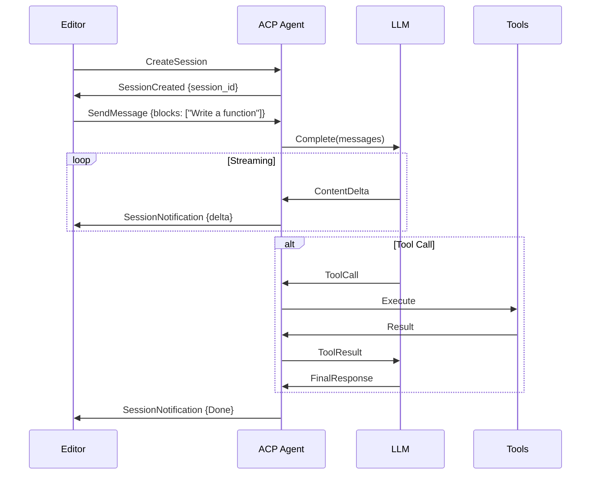

Loom integrates with code editors through the **Agent Client Protocol (ACP)**, enabling seamless AI assistance directly in your development environment.

## Supported Editors

<CardGroup cols={2}>
  <Card title="VS Code" icon="code" href="#vs-code-via-acp">
    Official support via ACP over stdio
  </Card>
  <Card title="Zed" icon="pen-to-square">
    Native ACP support (built-in)
  </Card>
  <Card title="Custom Clients" icon="plug">
    Any editor with ACP support
  </Card>
</CardGroup>

## Agent Client Protocol (ACP)

ACP is a protocol for connecting AI agents to code editors. Loom implements ACP to provide a consistent interface across different editors.

### Architecture

```text
┌─────────────────┐         stdio          ┌──────────────────┐
│                 │ <──────────────────────>│                  │
│  Code Editor    │    JSON-RPC over        │   Loom ACP       │
│  (VS Code, Zed) │    stdin/stdout         │   Agent          │
│                 │                         │                  │
└─────────────────┘                         └──────────────────┘
                                                     │
                                                     │
                                            ┌────────▼─────────┐
                                            │                  │
                                            │  Loom Runtime    │
                                            │  - LLM Clients   │
                                            │  - Tool Registry │
                                            │  - Thread Store  │
                                            │                  │
                                            └──────────────────┘
```

**Key concepts:**

<AccordionGroup>
  <Accordion title="Session">
    An ACP **session** corresponds to a Loom **thread** (conversation). Sessions persist across editor restarts and maintain full conversation history.
    
    ```rust
    // loom-cli-acp/src/bridge.rs:121
    pub fn thread_id_to_session_id(thread_id: &ThreadId) -> SessionId {
        SessionId::new(thread_id.to_string())
    }
    
    pub fn session_id_to_thread_id(session_id: &SessionId) -> ThreadId {
        ThreadId::from_string(session_id.to_string())
    }
    ```
  </Accordion>
  
  <Accordion title="Content Blocks">
    User input is sent as ACP **content blocks** (text, images, etc.). Loom currently supports text blocks:
    
    ```rust
    // loom-cli-acp/src/bridge.rs:26
    pub fn content_blocks_to_user_message(blocks: &[ContentBlock]) -> Message {
        let text = blocks
            .iter()
            .filter_map(|block| match block {
                ContentBlock::Text(t) => Some(t.text.as_str()),
                _ => None,  // Ignore other block types for now
            })
            .collect::<Vec<_>>()
            .join("\n");
        
        Message::user(&text)
    }
    ```
  </Accordion>
  
  <Accordion title="Streaming">
    Assistant responses are streamed as **content chunks** for real-time display:
    
    ```rust
    // loom-cli-acp/src/bridge.rs:40
    pub fn text_to_content_chunk(text: String) -> ContentChunk {
        ContentChunk::new(text.into())
    }
    ```
  </Accordion>
  
  <Accordion title="Tool Execution">
    Tool calls are executed **locally** (not in the editor). The agent runs tools via Loom's tool registry and streams results back.
  </Accordion>
</AccordionGroup>

### Message Flow



## VS Code (via ACP)

Connect Loom to VS Code using the ACP protocol over stdio.

### Setup

<Steps>
  <Step title="Install Loom CLI">
    ```bash
    # Build from source
    cargo build --release -p loom-cli
    
    # Or download binary
    curl -L https://loom.ghuntley.com/download/loom-cli > loom
    chmod +x loom
    ```
  </Step>
  
  <Step title="Configure VS Code">
    Create a VS Code task to launch the ACP agent:
    
    **`.vscode/tasks.json`:**
    ```json
    {
      "version": "2.0.0",
      "tasks": [
        {
          "label": "Loom ACP Agent",
          "type": "shell",
          "command": "loom",
          "args": ["acp"],
          "isBackground": true,
          "problemMatcher": []
        }
      ]
    }
    ```
    
    **Or configure in settings:**
    ```json
    {
      "acp.agents": [
        {
          "name": "Loom",
          "command": "loom",
          "args": ["acp"],
          "models": [
            "claude-3-5-sonnet-20241022",
            "gpt-4-turbo",
            "gemini-1.5-pro"
          ]
        }
      ]
    }
    ```
  </Step>
  
  <Step title="Start Session">
    1. Open the Command Palette (`Cmd+Shift+P` / `Ctrl+Shift+P`)
    2. Run **"ACP: Start Session"**
    3. Select **"Loom"** from the agent list
    4. Start chatting in the ACP panel
  </Step>
</Steps>

### Authentication

The ACP agent uses the same authentication as the CLI:

```bash
# Device code flow (recommended)
loom login

# Or set API keys directly
export ANTHROPIC_API_KEY=sk-ant-api03-...
export OPENAI_API_KEY=sk-...
```

<Info>
  Credentials are stored in `~/.loom/credentials.json` and automatically used by the ACP agent.
</Info>

### Available Commands

The ACP agent supports all Loom tools:

<CardGroup cols={2}>
  <Card title="read_file" icon="file">
    Read file contents
  </Card>
  <Card title="write_file" icon="pen">
    Create or overwrite files
  </Card>
  <Card title="edit_file" icon="pencil">
    Search and replace in files
  </Card>
  <Card title="list_files" icon="folder">
    List directory contents
  </Card>
  <Card title="search_files" icon="magnifying-glass">
    Search code with regex
  </Card>
  <Card title="run_command" icon="terminal">
    Execute shell commands
  </Card>
  <Card title="github_search" icon="github">
    Search GitHub code
  </Card>
  <Card title="read_url" icon="globe">
    Fetch web pages
  </Card>
</CardGroup>

Example interaction:
```
You: Create a new Rust function to parse JSON

Assistant: I'll create a JSON parser function for you.
[Tool: write_file]
  path: src/parser.rs
  content: ...

Done! I've created src/parser.rs with a JSON parsing function.
```

## Implementation Details

### Session Management

Sessions map 1:1 to Loom threads:

```rust
// loom-cli-acp/src/session.rs
pub struct SessionState {
    pub session_id: SessionId,
    pub thread_id: ThreadId,
    pub created_at: DateTime<Utc>,
    pub last_activity: DateTime<Utc>,
}
```

**Session lifecycle:**

```rust
// loom-cli-acp/src/agent.rs
impl Agent for LoomAcpAgent {
    async fn create_session(&self, request: CreateSessionRequest) -> Result<Session, Error> {
        // Create new thread
        let thread = Thread::new(
            ThreadId::generate(),
            request.name.unwrap_or_default(),
            Utc::now(),
        );
        
        // Persist
        self.thread_store.save(&thread).await?;
        
        // Track session
        let session_id = thread_id_to_session_id(&thread.id);
        self.sessions.write().await.insert(
            session_id.clone(),
            SessionState {
                session_id: session_id.clone(),
                thread_id: thread.id.clone(),
                created_at: Utc::now(),
                last_activity: Utc::now(),
            },
        );
        
        Ok(Session {
            id: session_id,
            name: thread.name.clone(),
            created_at: thread.created_at,
        })
    }
}
```

### Streaming Implementation

Loom streams LLM responses as ACP notifications:

```rust
// loom-cli-acp/src/agent.rs
async fn send_message(&self, request: SendMessageRequest) -> Result<(), Error> {
    let session = self.get_session(&request.session_id).await?;
    let thread = self.thread_store.load(&session.thread_id).await?;
    
    // Convert ACP blocks to Loom message
    let user_message = content_blocks_to_user_message(&request.content);
    
    // Build LLM request
    let llm_request = LlmRequest::new(&self.config.model)
        .with_messages(thread_to_messages(&thread))
        .with_messages(vec![user_message.clone()])
        .with_tools(self.tool_registry.to_llm_tools());
    
    // Stream response
    let mut stream = self.llm_client.stream(llm_request).await?;
    
    while let Some(event) = stream.next().await {
        match event? {
            LlmEvent::ContentDelta(text) => {
                // Send to editor
                self.send_notification(
                    &request.session_id,
                    SessionNotification::ContentDelta(text_to_content_chunk(text)),
                ).await?;
            }
            LlmEvent::ToolCall(tool_call) => {
                // Execute tool locally
                let result = self.tool_registry.execute(&tool_call).await?;
                
                // Send result back to LLM
                // (continues streaming)
            }
            LlmEvent::Done { usage } => {
                // Persist conversation
                thread.add_message(message_to_snapshot(&user_message));
                thread.add_message(message_to_snapshot(&assistant_message));
                self.thread_store.save(&thread).await?;
                
                // Notify completion
                self.send_notification(
                    &request.session_id,
                    SessionNotification::Done {
                        stop_reason: StopReason::EndTurn,
                    },
                ).await?;
                break;
            }
        }
    }
    
    Ok(())
}
```

### Type Conversions

All conversions between ACP and Loom types are pure functions:

```rust
// loom-cli-acp/src/bridge.rs

// Message persistence
pub fn message_to_snapshot(message: &Message) -> MessageSnapshot {
    MessageSnapshot {
        role: loom_role_to_thread_role(message.role.clone()),
        content: message.content.clone(),
        tool_call_id: message.tool_call_id.clone(),
        tool_name: message.name.clone(),
        tool_calls: if message.tool_calls.is_empty() {
            None
        } else {
            Some(message.tool_calls.iter().map(tool_call_to_snapshot).collect())
        },
    }
}

// Thread restoration
pub fn thread_to_messages(thread: &Thread) -> Vec<Message> {
    thread
        .conversation
        .messages
        .iter()
        .map(snapshot_to_message)
        .collect()
}

// Stop reason mapping
pub fn map_stop_reason(had_error: bool, cancelled: bool) -> StopReason {
    if had_error || cancelled {
        StopReason::Cancelled
    } else {
        StopReason::EndTurn
    }
}
```

## Custom ACP Clients

You can build custom ACP clients for any editor or environment:

### Protocol Overview

ACP uses JSON-RPC 2.0 over stdio:

```json
// Request (stdin)
{
  "jsonrpc": "2.0",
  "id": 1,
  "method": "session/create",
  "params": {
    "name": "My Coding Session"
  }
}

// Response (stdout)
{
  "jsonrpc": "2.0",
  "id": 1,
  "result": {
    "id": "thread_abc123",
    "name": "My Coding Session",
    "created_at": "2025-03-03T12:00:00Z"
  }
}

// Notification (stdout)
{
  "jsonrpc": "2.0",
  "method": "session/notification",
  "params": {
    "session_id": "thread_abc123",
    "notification": {
      "type": "content_delta",
      "delta": {"text": "Here's the code you requested..."}
    }
  }
}
```

### Supported Methods

<Tabs>
  <Tab title="Session Management">
    ```typescript
    // Create session
    session/create {
      name?: string
    } -> {
      id: string,
      name: string,
      created_at: string
    }
    
    // List sessions
    session/list {} -> {
      sessions: Array<{
        id: string,
        name: string,
        created_at: string,
        last_activity: string
      }>
    }
    
    // Delete session
    session/delete {
      session_id: string
    } -> {}
    ```
  </Tab>
  
  <Tab title="Messaging">
    ```typescript
    // Send message
    session/send {
      session_id: string,
      content: Array<{
        type: "text",
        text: string
      }>
    } -> {}
    
    // Notifications (server -> client)
    session/notification {
      session_id: string,
      notification: 
        | {type: "content_delta", delta: {text: string}}
        | {type: "tool_call", tool: {name: string, args: object}}
        | {type: "done", stop_reason: "end_turn" | "cancelled"}
        | {type: "error", message: string}
    }
    ```
  </Tab>
  
  <Tab title="Configuration">
    ```typescript
    // Get capabilities
    agent/info {} -> {
      name: "Loom",
      version: "1.0.0",
      models: ["claude-3-5-sonnet-20241022", ...],
      tools: ["read_file", "write_file", ...]
    }
    ```
  </Tab>
</Tabs>

### Example Client (Python)

```python
import json
import subprocess
import sys

class LoomAcpClient:
    def __init__(self):
        self.proc = subprocess.Popen(
            ["loom", "acp"],
            stdin=subprocess.PIPE,
            stdout=subprocess.PIPE,
            text=True,
            bufsize=1
        )
        self.request_id = 0
    
    def send_request(self, method, params):
        self.request_id += 1
        request = {
            "jsonrpc": "2.0",
            "id": self.request_id,
            "method": method,
            "params": params
        }
        self.proc.stdin.write(json.dumps(request) + "\n")
        self.proc.stdin.flush()
        
        # Read response
        response = json.loads(self.proc.stdout.readline())
        return response.get("result")
    
    def listen_notifications(self):
        while True:
            line = self.proc.stdout.readline()
            if not line:
                break
            
            msg = json.loads(line)
            if "method" in msg:  # Notification
                yield msg["params"]

# Usage
client = LoomAcpClient()

# Create session
session = client.send_request("session/create", {"name": "Test"})
print(f"Session created: {session['id']}")

# Send message
client.send_request("session/send", {
    "session_id": session["id"],
    "content": [{"type": "text", "text": "Write a hello world function"}]
})

# Listen for response
for notification in client.listen_notifications():
    if notification["notification"]["type"] == "content_delta":
        print(notification["notification"]["delta"]["text"], end="")
    elif notification["notification"]["type"] == "done":
        print("\nDone!")
        break
```

## Debugging

### Enable Debug Logs

```bash
# Verbose output
LOOM_LOG=debug loom acp

# Trace all messages
LOOM_LOG=trace loom acp

# Log to file
LOOM_LOG=debug loom acp 2> acp-debug.log
```

### Inspect Protocol Messages

Use `tee` to capture stdio traffic:

```bash
# Capture input/output
loom acp 2>&1 | tee acp-output.log
```

### Common Issues

<AccordionGroup>
  <Accordion title="Agent Not Starting">
    **Symptom:** Editor shows "Failed to start agent"
    
    **Solutions:**
    - Check `loom` is in PATH: `which loom`
    - Test manually: `loom acp`
    - Check logs: `LOOM_LOG=debug loom acp`
  </Accordion>
  
  <Accordion title="Authentication Errors">
    **Symptom:** "Unauthorized" or "Invalid API key"
    
    **Solutions:**
    - Run `loom login` to authenticate
    - Check credentials: `cat ~/.loom/credentials.json`
    - Set API keys: `export ANTHROPIC_API_KEY=...`
  </Accordion>
  
  <Accordion title="Tools Not Working">
    **Symptom:** Tool calls fail or time out
    
    **Solutions:**
    - Check file permissions for `read_file`/`write_file`
    - Verify command exists for `run_command`
    - Check network for `github_search`/`read_url`
  </Accordion>
</AccordionGroup>

## Best Practices

<CardGroup cols={2}>
  <Card title="Persist Sessions" icon="database">
    Sessions are automatically persisted to disk. You can resume conversations after restarting the editor.
  </Card>
  
  <Card title="Use Specific Models" icon="sliders">
    Configure model per session based on task complexity. Use Claude Sonnet for coding, GPT-4 for general tasks.
  </Card>
  
  <Card title="Monitor Token Usage" icon="chart-line">
    Track token usage in notifications. Large codebases can consume significant context.
  </Card>
  
  <Card title="Graceful Shutdown" icon="power-off">
    The agent handles SIGTERM/SIGINT gracefully, ensuring all threads are saved before exit.
  </Card>
</CardGroup>

## Source Code Reference

- **ACP Agent:** `crates/loom-cli-acp/src/agent.rs`
- **Type Bridge:** `crates/loom-cli-acp/src/bridge.rs`
- **Session Management:** `crates/loom-cli-acp/src/session.rs`
- **CLI Integration:** `crates/loom-cli/src/main.rs`

<Info>
  Agent Client Protocol specification: [https://github.com/zed-industries/acp](https://github.com/zed-industries/acp)
</Info>