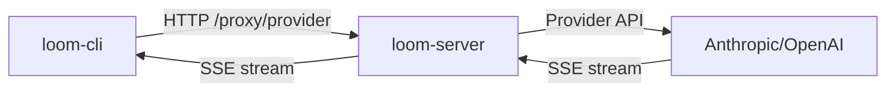

<Warning>
  **Loom is a research project.** This software is experimental, unstable, and under active development. APIs will change without notice. Features may be incomplete or broken. There is no support, no documentation guarantees, and no warranty of any kind. Use at your own risk.
</Warning>

## What is Loom?

Loom is an AI-powered coding agent built in Rust that provides a REPL interface for interacting with LLM-powered agents. It can execute tools to perform file system operations, code analysis, and other development tasks through a conversational interface.

The system uses a **server-side proxy architecture** where API keys are stored server-side only. Clients communicate through the proxy, ensuring your LLM provider credentials never leave the server.

## Core Principles

Loom is designed around three fundamental principles:

<CardGroup cols={3}>
  <Card title="Modularity" icon="cubes">
    Clean separation between core abstractions, LLM providers, and tools
  </Card>
  <Card title="Extensibility" icon="puzzle-piece">
    Easy addition of new LLM providers and tools via trait implementations
  </Card>
  <Card title="Reliability" icon="shield-check">
    Robust error handling with retry mechanisms and structured logging
  </Card>
</CardGroup>

## Architecture Overview

Loom is organized as a Cargo workspace with 30+ specialized crates:

```
loom/
├── crates/
│   ├── loom-common-core/      # Core abstractions, state machine, types
│   ├── loom-server/           # HTTP API server with LLM proxy
│   ├── loom-cli/              # Command-line interface
│   ├── loom-common-thread/    # Conversation persistence and sync
│   ├── loom-cli-tools/        # Agent tool implementations
│   ├── loom-server-llm-*/     # LLM provider integrations
│   ├── loom-server-auth*/     # Authentication and authorization
│   └── ...                    # Many more specialized crates
├── web/loom-web/              # Svelte 5 web frontend
├── specs/                     # Design specifications
└── infra/                     # Nix/K8s infrastructure
```

## Key Components

| Component | Description |
|-----------|-------------|
| **Core Agent** | State machine for conversation flow and tool orchestration |
| **LLM Proxy** | Server-side proxy architecture - API keys never leave the server |
| **Tool System** | Registry and execution framework for agent capabilities |
| **Weaver** | Remote execution environments via Kubernetes pods |
| **Thread System** | Conversation persistence with FTS5 search |
| **Analytics** | PostHog-style product analytics with identity resolution |
| **Auth** | OAuth, magic links, ABAC authorization |
| **Feature Flags** | Runtime feature toggles, experiments, and kill switches |

## Server-Side LLM Proxy

All LLM interactions flow through a server-side proxy:



API keys are stored server-side only. The CLI communicates through `/proxy/{provider}/complete` and `/proxy/{provider}/stream` endpoints.

## Available Tools

Loom agents have access to the following tools:

- **ReadFileTool** - Read file contents
- **EditFileTool** - Edit files with precise string replacements
- **ListFilesTool** - List directory contents
- **BashTool** - Execute shell commands
- **OracleTool** - Query server-side knowledge base
- **WebSearchToolGoogle** - Search using Google Custom Search
- **WebSearchToolSerper** - Search using Serper API

## Next Steps

<CardGroup cols={2}>
  <Card title="Quick Start" icon="rocket" href="/quickstart">
    Get up and running with your first REPL session
  </Card>
  <Card title="Installation" icon="download" href="/installation">
    Build Loom using Nix or Cargo
  </Card>
  <Card title="Specifications" icon="book">
    Explore design docs in `specs/README.md` for implementation details
  </Card>
  <Card title="Source Code" icon="github">
    All code is proprietary - Copyright (c) 2025 Geoffrey Huntley
  </Card>
</CardGroup>

## LLM Providers

Loom supports multiple LLM providers through the `ProxyLlmClient`:

- **Anthropic** (Claude models) - Default provider
- **OpenAI** (GPT models)
- **Vertex AI** (Google Cloud)
- **zAI** (Custom provider)

Providers are configured server-side and selected via the `--provider` flag or `LOOM_LLM_PROVIDER` environment variable.
